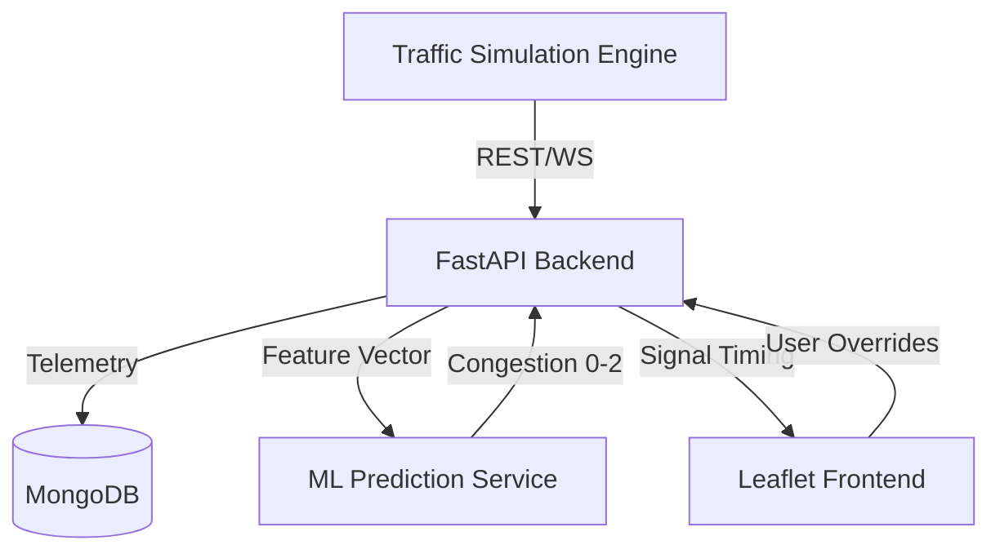

# 🚦 PreClear AI — Intelligent Traffic & Emergency Management System

[](https://opensource.org/licenses/MIT)
[]()

**PreClear AI** is a smart, predictive traffic management platform designed to eliminate urban gridlock and automate emergency vehicle prioritization. By combining machine learning with real-time junction coordination, PreClear AI proactively clears "green corridors" before an ambulance even arrives at a junction.

---

## 🚀 Core Features

### 🚑 1. Predictive Emergency Pre-clearing
Automatically identifies emergency vehicles and calculates the shortest, most efficient route. It forces signals to **GREEN** along the path while blocking cross-traffic to ensure zero delays.

### 🤖 2. ML-Based Congestion Forecasting
Uses a **Random Forest Classifier** trained on 7 key features (vehicle count, speed, weather, events, etc.) to predict congestion levels (Smooth, Moderate, Heavy) in real-time.

### 🔄 3. Multi-Junction Signal Coordination
Instead of isolated signals, PreClear AI coordinates timing across multiple junctions to prevent the "ripple effect" of traffic bottlenecks.

### 🗺️ 4. Interactive Live Map
A high-performance Leaflet-based visualization engine showing real-time traffic density, signal states, and active emergency routes.

---

## 🏗️ Technical Architecture



### 🛠️ Tech Stack
- **Backend**: FastAPI (Python 3.10+), Motor (Async MongoDB), WebSockets.
- **Intelligence**: Scikit-Learn (Random Forest), Pandas, Joblib.
- **Frontend**: React/Vanilla JS, Leaflet.js, Vanta.js (Landing), GSAP (Scroll Animations).
- **Orchestration**: Docker & Docker Compose.

---

## 📁 Project Structure

- `backend/`: Principal API and decision engine logic.
- `ml-service/`: Microservice for real-time traffic prediction.
- `frontend/`: Interactive map and storytelling landing page.
- `simulate_traffic.py`: Root-level telemetry generator for demonstration.
- `docker-compose.yml`: One-click orchestration for the entire stack.

---

## 🛠️ Quick Start & Installation

### Prerequisites
- [Docker](https://www.docker.com/get-started) & [Docker Compose](https://docs.docker.com/compose/install/)
- [Python 3.10+](https://www.python.org/downloads/) (for local simulation)

### 1. Clone the Repository
```bash
git clone https://github.com/Rugpullers/PreClear.git
cd PreClear
```

### 2. Launch Services
Run the full stack (Backend, ML Service, and MongoDB) with a single command:
```bash
docker-compose up --build
```

### 3. Start Traffic Simulation
In a separate terminal, trigger the telemetry generator:
```bash
python simulate_traffic.py
```

### 4. Access the Platform
- **Landing Page**: Open `frontend/index.html` in your browser.
- **Live Map**: Open `frontend/heatmap.html`.
- **API Documentation**: [http://localhost:8000/docs](http://localhost:8000/docs)

---

## 💡 MVP Demo Script
1. **The Hook**: Watch the "Sky-to-Street" landing animation.
2. **Real-time Map**: Observe junctions turning 🟢, 🟠, or 🔴 based on telemetry.
3. **Emergency Scenario**: Click **"Trigger Ambulance"** and watch the system forcefully clear the route.
4. **Predictive Impact**: Compare current density vs. predicted congestion to see the AI advantage.

---

## 🏆 The PreClear Advantage
> “We don’t just react to traffic — we predict it and clear the path for those who need it most.”

---

## 👥 Team & Contribution
Developed during a high-stakes hackathon by the PreClear Team. 

**License**: [MIT](LICENSE)
