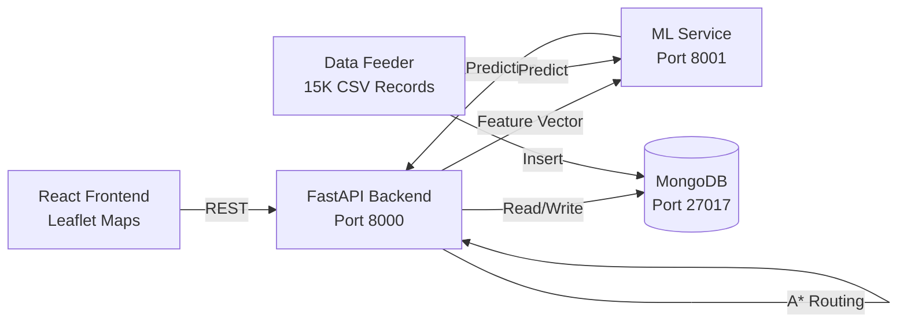

# 🚦 PreClear AI — Intelligent Traffic & Emergency Management System

[](https://opensource.org/licenses/Apache-2.0)
[]()

**PreClear AI** is a smart, predictive traffic management platform designed to eliminate urban gridlock and automate emergency vehicle prioritization. By combining machine learning with real-time junction coordination, PreClear AI proactively clears "green corridors" before an ambulance even arrives at a junction.

---

## 🚀 Core Features

### 🚑 1. Predictive Emergency Pre-clearing
Automatically identifies emergency vehicles and calculates the shortest, most efficient route. It forces signals to **GREEN** along the path while blocking cross-traffic to ensure zero delays.

### 🤖 2. ML-Based Congestion Forecasting
Uses **LightGBM** and **LSTM** models trained on 15,000+ Bangalore traffic records to predict congestion levels (Low, Medium, High) in real-time with 95%+ confidence.

### 🗺️ 3. A* Optimal Routing
Calculates the fastest route between 10 Bangalore junctions using A* pathfinding with a haversine heuristic. Edge weights are dynamically penalized based on **live ML predictions** — meaning routes adapt as congestion changes.

### 🔥 4. Live Traffic Heatmap
Real-time Leaflet-based visualization with auto-refreshing junction markers that change between 🟢 LOW, 🟡 MEDIUM, and 🔴 HIGH as the data feeder cycles through the dataset.

### 🗺️ 5. Interactive Route Planner
Split-panel dashboard with a glassmorphism form and a dark-themed Leaflet map. Routes are drawn on real roads via OSRM, with color-coded congestion badges per segment.

---

## 🏗️ Technical Architecture



### 🛠️ Tech Stack
| Layer | Technologies |
|-------|-------------|
| **Frontend** | React 18, TypeScript, Vite, Leaflet.js, GSAP, Vanta.js |
| **Backend** | FastAPI, Motor (Async MongoDB), NetworkX, httpx |
| **ML Service** | LightGBM, TensorFlow/Keras (LSTM), scikit-learn |
| **Database** | MongoDB |
| **Orchestration** | Docker & Docker Compose |

---

## 📁 Project Structure

```
PreClear/
├── backend/                    # FastAPI backend
│   ├── main.py                 # App entrypoint & lifespan
│   ├── routes/                 # API route handlers
│   │   ├── health.py           # Health check
│   │   ├── traffic.py          # Traffic CRUD & heatmap
│   │   ├── predict.py          # ML prediction proxy
│   │   └── routing.py          # A* optimal routing
│   ├── services/
│   │   ├── traffic_service.py  # MongoDB traffic operations
│   │   ├── routing_service.py  # A* pathfinding with NetworkX
│   │   ├── data_feeder.py      # Background CSV data feeder
│   │   └── ml_service.py       # ML service HTTP client
│   ├── data/                   # CSV dataset for live feeding
│   ├── core/config.py          # Environment settings
│   └── Dockerfile
├── ml-service/                 # ML microservice
│   ├── main.py                 # FastAPI prediction endpoints
│   ├── model/                  # Trained model artifacts
│   │   ├── lgbm_traffic_classifier.txt
│   │   ├── lstm_traffic_forecaster.keras
│   │   └── *.pkl               # Scalers & feature lists
│   ├── utils/preprocessing.py  # Feature engineering
│   └── Dockerfile
├── frontend/                   # React + Vite application
│   ├── src/
│   │   ├── components/Map/     # Reusable Leaflet map
│   │   ├── pages/
│   │   │   ├── RoutePlanner/   # Route planning + map
│   │   │   ├── TrafficData/    # Live heatmap dashboard
│   │   │   ├── LoginPage/      # Yeti login animation
│   │   │   └── AboutPage/      # About page
│   │   └── App.tsx             # Router
│   └── package.json
├── docker-compose.yml          # Full stack orchestration
└── README.md
```

---

## 🛠️ Quick Start & Installation

### Prerequisites
- [Docker](https://www.docker.com/get-started) & [Docker Compose](https://docs.docker.com/compose/install/)
- [Node.js 18+](https://nodejs.org/) (for frontend dev)

### 1. Clone the Repository
```bash
git clone https://github.com/Rugpullers/PreClear.git
cd PreClear
```

### 2. Launch Backend Services
Run the full stack (Backend, ML Service, and MongoDB) with a single command:
```bash
docker-compose up --build -d
```

This starts:
- **Backend API** — `http://localhost:8000` (Swagger docs at `/docs`)
- **ML Service** — `http://localhost:8001`
- **MongoDB** — `localhost:27017`
- **Data Feeder** — auto-starts after 5 seconds, cycling through 15,000 CSV records

### 3. Launch Frontend
```bash
cd frontend
npm install
npm run dev
```
Frontend runs at `http://localhost:5173`

---

## 📡 API Endpoints

| Method | Endpoint | Description |
|--------|----------|-------------|
| `GET` | `/health` | Backend health check |
| `GET` | `/traffic-data` | Fetch traffic records |
| `POST` | `/traffic-data` | Insert traffic data |
| `GET` | `/traffic-status` | Latest congestion level per junction |
| `GET` | `/traffic-heatmap` | Aggregated heatmap data (latest per junction) |
| `POST` | `/predict` | ML congestion prediction (proxied to ML service) |
| `GET` | `/optimal-route` | A* optimal route between two junctions |
| `GET` | `/junctions` | List all 10 available junctions |
| `GET` | `/feeder/status` | Data feeder status |
| `POST` | `/feeder/start` | Start data feeder |
| `POST` | `/feeder/stop` | Stop data feeder |

---

## 💡 Demo Script
1. **The Hook**: Navigate to `/` — watch the scroll-driven landing animation.
2. **Real-time Heatmap**: Go to `/traffic-data` — observe junctions turning 🟢, 🟡, or 🔴 every 5 seconds.
3. **Route Planning**: Go to `/route-planner` — select Hebbal Flyover → Electronic City Flyover → see the route drawn on real roads with ETA and congestion badges.
4. **Emergency Mode**: Click the 🚑 Ambulance button to simulate priority routing.

---

## 🏆 The PreClear Advantage
> "We don't just react to traffic — we predict it and clear the path for those who need it most."

---

## 👥 Team & Contribution
Developed during a high-stakes hackathon by the PreClear Team.

**License**: [APACHE 2.0](LICENSE)
